# Resultados 

Se va mostrar las diferentes conductas de los valores recopilados de las dos bases de datos `proyecto.db` y `final.db`. En esta primera parte de los resultados, se va observar el comportamiento de los datos de las `variable_1` y `variable_2` en histogramas proveniente de proyecto.db. 

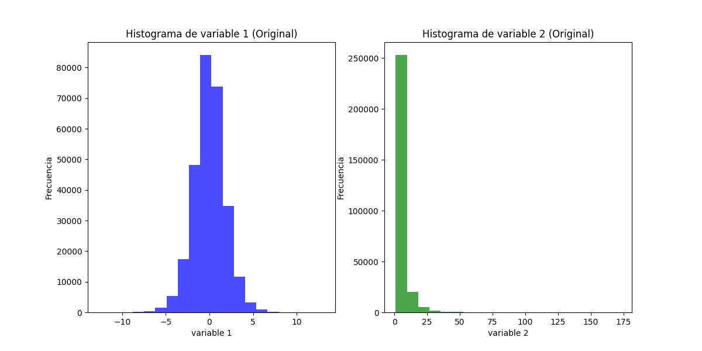

  <strong>Figura 1: Histogramas de las variables.</strong>

Ahora utlizando la misma imagen pero aplicandoles los modelos de probabilidad. En donde se puede apreciar como como la `variable_1` tiene un comportamiento normal o más conocido como campana de Gauss, por otra parte la `variable_2` posee un comportamiento exponecial.

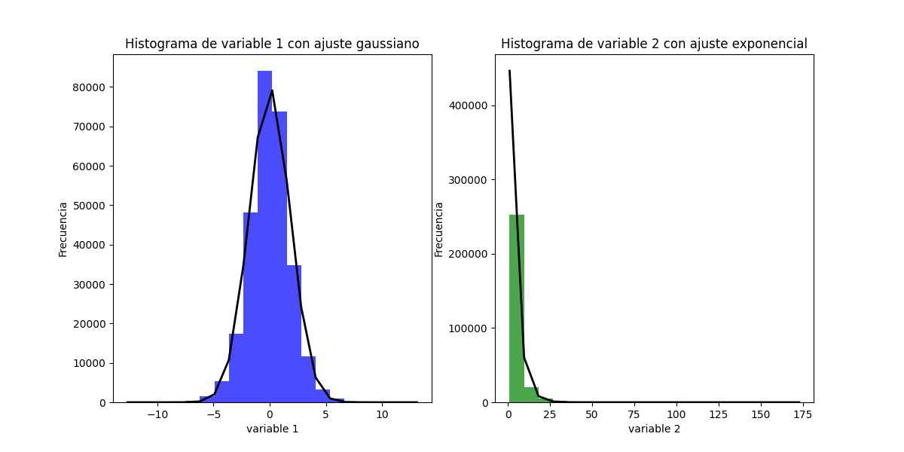

  <strong>Figura 2: Modelos de probabilidad en los histogramas de las variables.</strong>

Finalmente, se aprecia los momentos de los modelos:

**Tabla 1: Datos de los momentos de variable_1.**

$$
\begin{array}{|c|c|}
\hline
\textbf{Momento} & \textbf{Valor} \\
\hline
\text{Promedio} & 0.0030754730077360497 \\
\hline
\text{Varianza} & 3.2927034329900775 \\
\hline
\text{Desviación estándar} & 1.8145807871213884 \\
\hline
\text{Inclinación} & 0.010291901241070064 \\
\hline
\text{Kurtosis} & 1.1335262206667638 \\
\hline
\end{array}
$$

**Tabla 2: Datos de los momentos de variable_2.**

$$
\begin{array}{|c|c|}
\hline
\textbf{Momento} & \textbf{Valor} \\
\hline
\text{Promedio} & 4.292701198685403 \\
\hline
\text{Varianza} & 33.974125486393426 \\
\hline
\text{Desviación estándar} & 5.828732751327121 \\
\hline
\text{Inclinación} & 4.89787631161442 \\
\hline
\text{Kurtosis} & 44.381358162707954 \\
\hline
\end{array}
$$

Ahora con la correspondiente respuesta de los datos de final.db, primero se realiza la identificación de la distribución utilizando fitter y procede en graficar los resultados. Para esto se obtuvo que el proceso aleatorio total tiene una distribución logística. Asimismo se realiza análisis de las distribuciones por separado de los valores recopilados durante el día y durante la nocho. En estos se posee como resultado una distribución logística como mejor ajuste, a pesar de las distintas formas de las curvas generadas por los valores de día y de noche. A continuación, se adjuntan las gráficas generadas por fitter para el mejor ajuste a los datos:

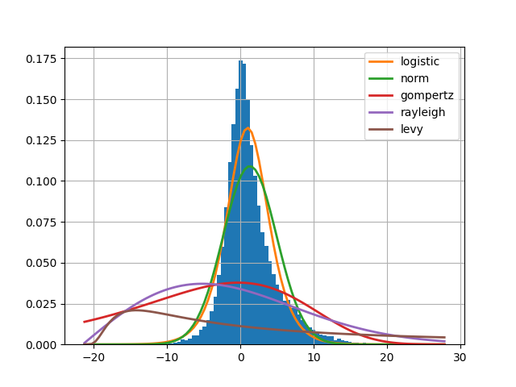

  <strong>Figura 3:  Mejor ajuste para el total de los datos.</strong>

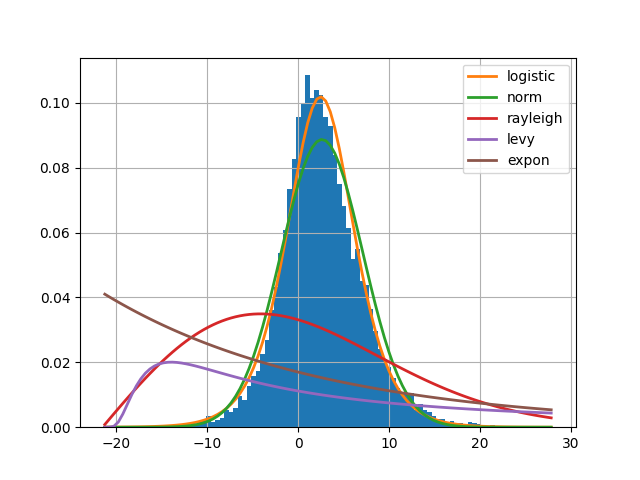

  <strong>Figura 4: Mejor ajuste para los datos del día.</strong>

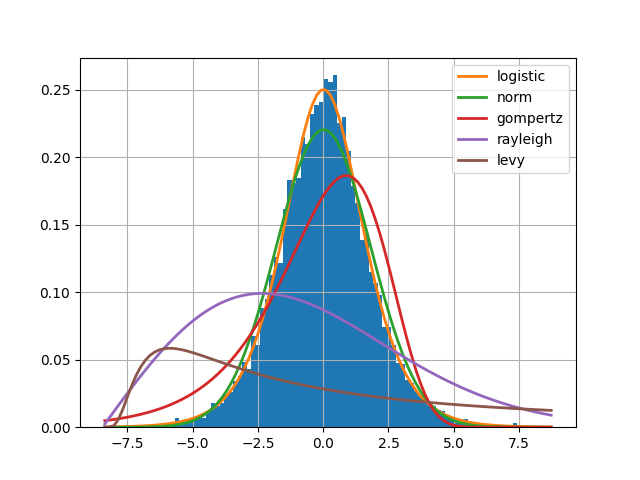

  <strong>Figura 5: Mejor ajuste para los datos recopilados en la noche.</strong>

Con ayuda de Fitter se logra identificar la mejor distribución da los parámetros necesarios como se observa en la siguiente tabla 3:

**Tabla 3: Parámetros para la distribución total, de día y de noche.**

$$
\begin{array}{|c|c|c|}
\hline
\textbf{Mejor distribución encontrada} & \textbf{loc} & \textbf{scale} \\
\hline
\text{Total} & 0.997576650579749 & 1.8860023725549602 \\
\hline
\text{Día} & 2.4822584836019566 & 2.453965330170772 \\
\hline
\text{Noche} & 0.013651019611499747 & 0.9985277219969785 \\
\hline
\end{array}
$$

Para encontrar la función de densidad de probabilidad de este proceso aleatorio se identifica primero si se tienen los parámetros loc y scale del fitter. Después se compara los parámetros y observar si si tienen relación con los parámetros de la función de densidad matemática de una distribución logística. Para esto se trabaja con la ecuación de  la función de densidad de probabilidad, como  se aprecia a continuación:

$$
$$\frac{e^{-\frac{(x - \mu)}{s}}}{s \left(1 + e^{-\frac{(x - \mu)}{s}} \right)^2}$$
$$

Sin embargo, esa fórmula es para una variable aleatoria, para un proceso aleatorio se tiene la siguiente fórmula:

$$
$$ \frac{e^{-\frac{(x(t) - \mu(t))}{s(t)}}}{s(t) \left(1 + e^{-\frac{(x(t) - \mu(t))}{s(t)}} \right)^2} $$
$$

Y que en esta instancia se considera el tiempo, la correspondencia entre los valores de los parámetros es la siguiente:

    • scale = s
    • loc = μ 
    
Por lo tanto no se necesita hacer conversiones una vez que se tengan las expresiones con respecto al tiempo, para obtenerlas es necesario graficar los valores de los parámetros con respecto al tiempo como se aprecia en las siguientes figuras:

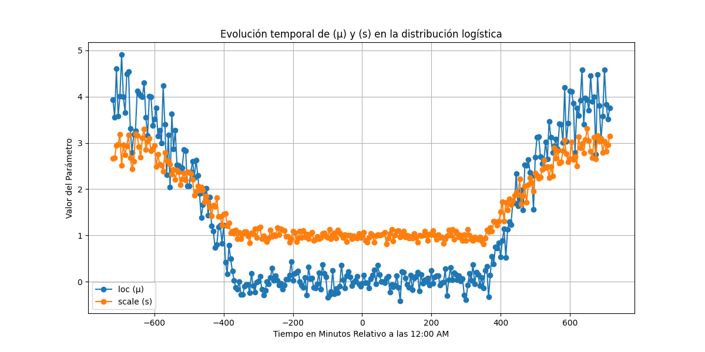

  <strong>Figura 6: Gráfico de evolución temporal de μ y s con respecto al tiempo.</strong>

Se grafican los datos con respecto al tiempo relativo a las 12:00 am por indicación del profesor, esto debido a que no se empezó a recopilar datos a las 12 am si no aproximadamente a las 3 am. Posteriormente se realiza una aproximación polinomial para estos parámetros y se grafica dicha aproximación:

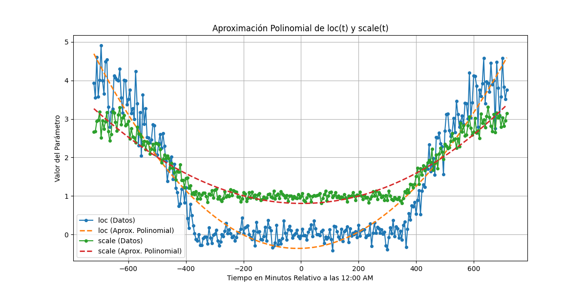

  <strong>Figura 7: Aproximación polinomial de loc(t) y scale(t).</strong>

La aproximación realizada es de grado 3, esto debido a que al realizar aproximaciones con un grado más alto no se consiguió mejoría en la aproximación, dando como resulatdo la siguiente tabla:

**Tabla 4: Resultado de la aproximación polinomial normalizados.**

$$
\begin{array}{|c|l|}
\hline
\textbf{Parámetro} & \textbf{Expresión polinomial (tiempo normalizado)} \\
\hline
\text{loc (μ)} & -0.3618171 + 0.06885857 \cdot x + 1.67982747 \cdot x^2 - 0.0330693 \cdot x^3 \\
\hline
\text{scale (s)} & 0.80663577 - 0.02058139 \cdot x + 0.84235934 \cdot x^2 + 0.01650874 \cdot x^3 \\
\hline
\end{array}
$$

Sin embargo, estas expresiones con respecto al tiempo son para tiempo normalizado, esto debido a que con el tiempo sin normalizar los valores de las expresiones polinomiales se mantenían con el valor constante inicial. Por lo que se optá por normalizar el tiempo, para esto se consiguen las expresiones y luego desnormalizarlas. Con lo anterior se consigue lo siguiente:

**Tabla 5: Resultado de la aproximación polinomial desnormalizados.**

$$
\begin{array}{|c|l|}
\hline
\textbf{Parámetro} & \textbf{Expresión polinomial desnormalizada} \\
\hline
\text{loc (μ)} & -0.36181611 + 0.00016577 \cdot x + 9.72133267 \cdot 10^{-6} \cdot x^2 - 4.60380901 \cdot 10^{-10} \cdot x^3 \\
\hline
\text{scale (s)} & 0.80663547 - 4.94528023 \cdot 10^{-5} \cdot x + 4.87482764 \cdot 10^{-6} \cdot x^2 + 2.29829663 \cdot 10^{-10} \cdot x^3 \\
\hline
\end{array}
$$

Es importante aclarar que la x corresponde a la t en este caso. Ahora se tiene que reemplazar en la función de densidad, presentando lo siguiente:

**Tabla 6: Resultado de la aproximación polinomial de la función de densidad.**

$$
\begin{array}{|c|l|}
\hline
\textbf{Variable} & \textbf{Ecuación} \\
\hline
\mu(t) & -0.36181611 + 0.00016577 \cdot t + (9.72133267 \cdot 10^{-6}) \cdot t^2 - (4.60380901 \cdot 10^{-10}) \cdot t^3 \\
\hline
s(t) & 0.80663547 - (4.94528023 \cdot 10^{-5}) \cdot t + (4.87482764 \cdot 10^{-6}) \cdot t^2 + (2.29829663 \cdot 10^{-10}) \cdot t^3 \\
\hline
\end{array}
$$

Con lo anterior se obtiene la función de densidad de probabilidad del proceso aleatorio. Ahora se pasa a la estacionaridad en sentido amplio, para ello se genera un gráfico de la media de los intervalos recopilados de cada 5 minutos.

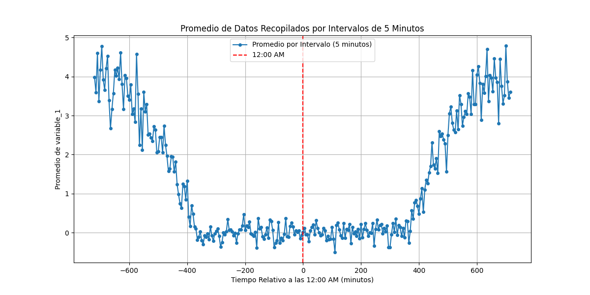

  <strong>Figura 8: Gráfico de promedio de datos recopilados en los intervalos de 5 minutos</strong>

Para que un proceso sea estacionario en sentido amplio se necesita que la media sea constante y que las medidas de autocorrelación entre distintos pares de instantes de tiempo se mantengan iguales. Para este proceso se identifica que no es estacionario en sentido amplio ni en el día ni en la noche, esto se concluye debido a que la media nunca es constante, siempre se tiene una fluctuación amplia en los valores de la media, eso se observa en el gráfico de la figura 8. Debido a que los valores recopilados cambian mucho y tienen magnitudes muy alejadas una de la otra. Aunque se cree que es posible que el proceso si sea estacionario en sentido amplio pero que no se pueda visualizar esto debido a la frecuencia de recopilación de los datos. Además, se observa una tendencia de los valores se vuelven más estables conforme más cerca se está de la media noche.Ya que el proceso en su totalidad no es estacionario, se puede decir que tampoco es ergódico, sin embargo, se realizó un gráfico para visualizar el promedio temporal de la función de muestra

  <strong>Figura 9: Gráfico de los primeros valores de cada recopilación y su promedio temporal. </strong>

Esta recopilación de los primero valores corresponde a la función de muestra y se tiene su promedio temporal que es 1,07. Sin embargo, este promedio temporal no se compara con el promedio estadístico para la ergodicidad debido a que el promedio estadístico no es constante, en ningún punto, por lo que el proceso no es ergódico .

Respecto al análisis la densidad espectral de la potencia, en el cual consiste en observar la districión de la señal potencial en función de la frecuencia. Este se obtuvo a través de la Transformada de Fourier aplicada a la función de densidad obtenida previamente. Sin embargo, para hacer éste estudio se filtra la base de datos, debido a la gran cantidad de estos, ya que, habían aproximadamente 100 datos por cada instancia de tiempo. Por ejemplo, en el instante `1:00:38` se capturaban 100 datos, y en el instante `1:00:55` se capturaban otros 100 datos, lo que genera la cantidad de datos finales bastante pesados. Lo anterior, es necesario para conseguir la función de densidad, estos mismos datos presentan dificultades a la hora de determinar la Densidad de Potencia. Esto es porque, la Transformada de Fourier necesita distancias significativas entre puntos, por lo tanto es necesario escoger un dato aleatorio entre esos 100 tomados en un solo instante de tiempo. Esto permite que la distancia entre los datos sea mayor, así se aplique la transformada y se pueda visualizar de una manera adecuada. Enl a siguiente 10 se percibe como la potencia de la señal es mayor mientras más cercana a 0 sea la frecuencia.

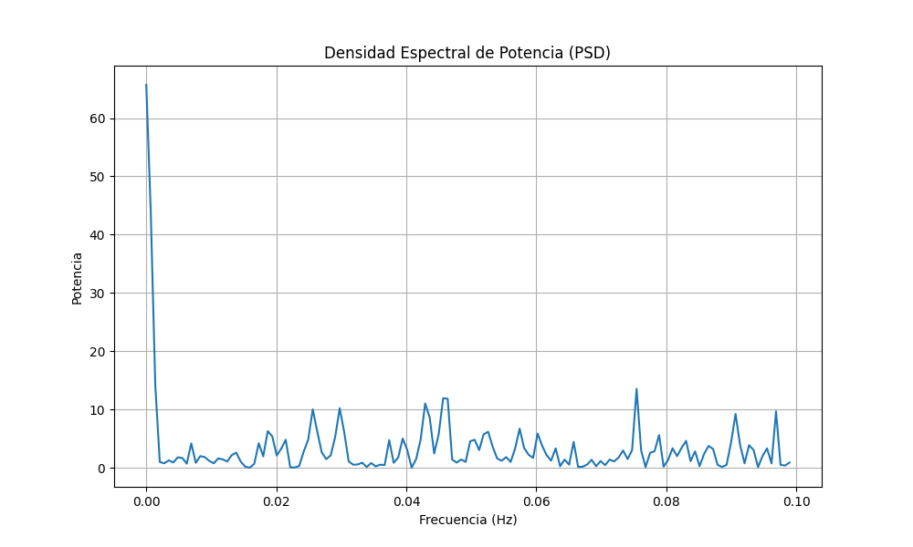

  <strong>Figura 10: Densidad Espectral de Potencia. </strong>

Seguidamente se muestra la tabla 7 con los resultados obtenidos en el análisis de las métricas y señales:

**Tabla 7: Resultados de métricas estadístico-temporales y de señales.**

$$
\begin{array}{|l|c|}
\hline
\textbf{Métrica} & \textbf{Valor} \\
\hline
\text{Promedio temporal de los primeros valores de cada recopilación} & 1.073783553898175 \\
\hline
\text{Covarianza entre el Tiempo y la Variable} & 1.9581171261547747 \\
\hline
\text{Correlación Tiempo y la Variable} & 0.001293438230163875 \\
\hline
\text{Número de datos} & 29100 \\
\hline
\text{SNR (relación señal a ruido)} & 4417012282708.929 \\
\hline
\text{Desviación estándar del ruido} & 1.958114412126959 \\
\hline
\text{Coeficiente de correlación entre señal y ruido} & 1.0 \\
\hline
\text{Potencia promedio} & 15.087435847327233 \\
\hline
\text{Planitud espectral de ruido} & 0.40328378766660158 \\
\hline
\text{Relación pico a pico de la señal ajustada} & 14.130312597175166 \\
\hline
\text{Relación pico a pico de la señal ajustada y ruido} & 14.130312597175166 \\
\hline
\text{Varianza de la señal ajustada} & 3.8209448812360987 \\
\hline
\text{Desviación estándar de la señal ajustada} & 1.954723735272097 \\
\hline
\text{Varianza del ruido} & 3.8209448812360987 \\
\hline
\text{Desviación estándar del ruido} & 1.9547237352720963 \\
\hline
\end{array}
$$

Primeramente, se puede ver la covarianza y la correlación entre el valor del tiempo, además, del valor de la variable aleatoria capturada. Su correlación es bastante cercana a 0, lo que nos indica que no hay una relación lineal significativa entre ambas variables. Los cambios en una variable no se relacionan de manera consistente. Es más, se podrían considerar variables independientes una de la otra.  El valor de la covarianza nos indica ambas variables tienden a aumentar o disminuir en conjunto. Tiene sentido que la covarianza sea alta y que la correlación sea baja, ya que la dispersión de los datos capturados es bastante alta, y que, nuevamente, su relación lineal es débil. Posteriormente, se puede ver como el valor de SNR es completamente alto, lo que nos indica que el ruido es bajo.  Luego, se puede ver  el valor de la Potencia Promedio correspondiente de los datos, tiene un valor de aproximadamente 15. 

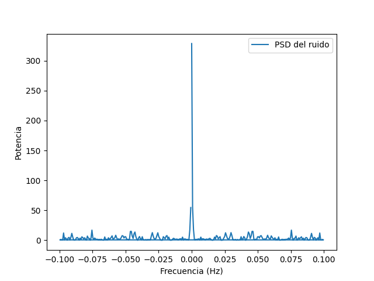

  <strong>Figura 11: PSD del Ruido. </strong>

De la figura anterior, se puede ver de manera similar a la potencia, cuando la frecuencia se acera a un valor de 0, esta tiende a la exponencial y muy significativa hacia un valor de aproximadamente 300. Por otro lado, el valor de planitud espectral es cercano a 0, muy pequeño. Esto nos indica la distribución de la energía a través del espectro de frecuencias.

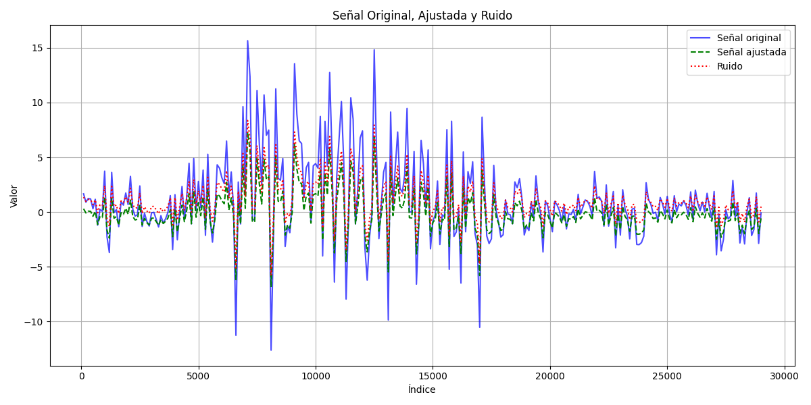

  <strong>Figura 12: Análisis de Ruido. </strong>

Finalmente, en el estudio del ruido se consigue una señal extra, además de la señal original de ruido y la señal original de los datos. Esta señal extra se añade para lograr un punto medio entre el ruido y la señal original. Así se visualiza como los valores de ruido son mayores, para las 3 señales son los valores de índice de cinco mil y diecisiete mil. A partir de los índices de veinte mil, las 3 ondas se “estabilizan” y el ruido disminuye. Por otro lado, se puede ver como la señal correspondiente al ruido es considerablemente menor a la señal original, a pesar de tener un comportamiento muy similar. La disminución de magnitud entre ambas señales se puede deber al hecho de que el ruido es relativamente menor cuando se compara con el con la función original.

